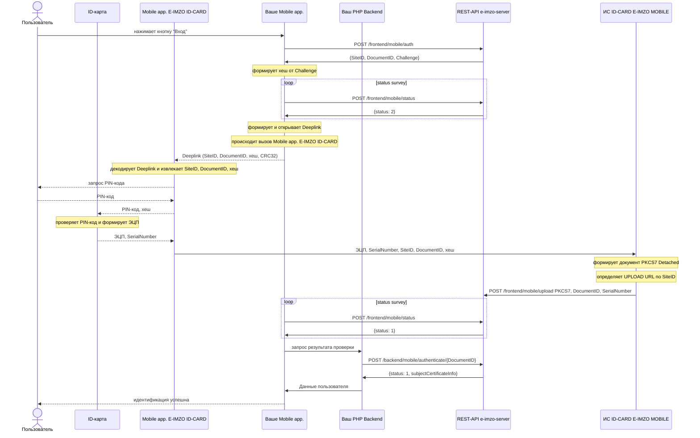
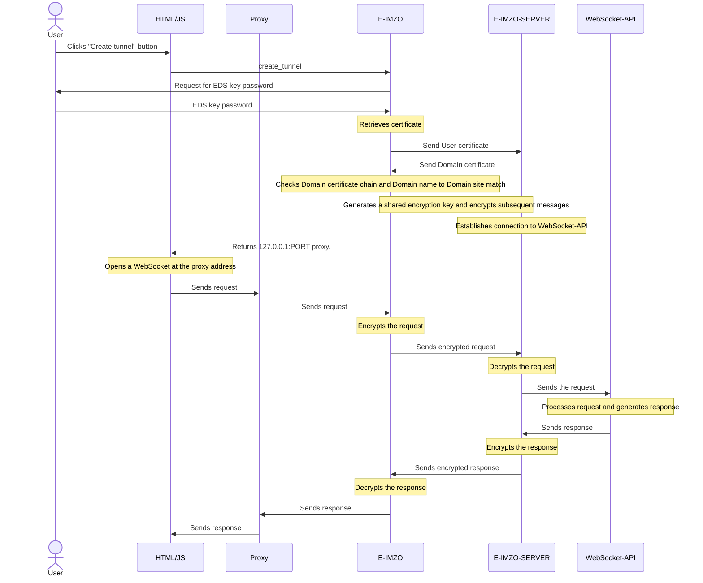

# E-IMZO - ИНСТРУКЦИЯ ПО ИНТЕГРАЦИИ

# 1. E-IMZO

## 1.1. Установка API-KEY для домена

Before calling E-IMZO functions, it is necessary to set the API-KEY for the domain (from which the call is made) when loading the HTML page (window.onload)

    var API_KEYS = [
      'localhost', '96D0C1491615C82B9A54D9989779DF825B690748224C2B04F500F370D51827CE2644D8D4A82C18184D73AB8530BB8ED537269603F61DB0D03D2104ABF789970B',
      '127.0.0.1', 'A7BCFA5D490B351BE0754130DF03A068F855DB4333D43921125B9CF2670EF6A40370C646B90401955E1F7BC9CDBF59CE0B2C5467D820BE189C845D0B79CFC96F'
      // add your Domain and API-KEY here
    ];
    
    CAPIWS.apikey(API_KEYS, function (event, data) {
        console.log(data);
        if (data.success) {
            // Successful - E-IMZO functions can be called

        } else {
            // Error - possibly invalid API-KEY
            window.alert(data.reason);
        }
    }, 
    function(error){
      // WebSocket connection error
      window.alert(error);
    });

## 1.2. Document Creation PKCS#7

To create a document [PKCS#7](https://www.rfc-editor.org/rfc/rfc2315) function is applied [`create_pkcs7`](http://127.0.0.1:64646/apidoc.html#pkcs7.create_pkcs7)

    CAPIWS.callFunction({
        plugin    :"pkcs7",
        name      :"create_pkcs7",
        arguments :[
          //BASE64 encoded data (will be pre-decoded, signed and attached to the document)
          data_64,
          //Signer's key identifier (obtained from other plugins)
          id,
          //Possible values: 'yes' - PKCS#7/CMS document will be created without attaching source data, 'no' or '' - PKCS#7/CMS document will be created with attaching source data.
          detached
        ]
      },
      function(event, data){
        console.log(data);
        if (data.success) {
          // Successfully
          var pkcs7 = data.pkcs7_64;
                
        } else {
          // Processing error in E-IMZO
          window.alert(data.reason);
        }
      },
      function(error){
        // WebSocket connection error
        window.alert(error);
      }
    );

Parameter `id`:
 - If you want to sign with a PFX key, `id` must be obtained from the `load_key` function
 - If you want to sign with ID-card key, then `id` = `"idcard"`.

See example https://test.e-imzo.uz/demo/

## 2. E-IMZO-SERVER

E-IMZO-SERVER - software designed for User Authentication by EDS and PKCS#7 document signature verification. 

## 2.1. Startup and customization

Startup requires:
 - JRE v1.8. (update 322) (Docker image: `openjdk:8u322-oraclelinux8`)
 - Internet connection to the server `vpn.e-imzo.uz:3443` (`testvpn.e-imzo.uz:2443` for testing) (servers are available only from Uzbekistan).
 - Configuration files and VPN keys (may be in a separate zip file, extract them to the directory where e-imzo-server.jar is located).

Start is performed by the command:

    java -Dfile.encoding=UTF-8 -jar e-imzo-server.jar config.properties

After launching, a log will be printed in the console with the following content:
```
Sep 27, 2022 9:55:03 AM uz.yt.eimzo.server.Application main
INFO: e-imzo-server version: 1.1.1
********************************************************************************

TERMS OF USE OF E-IMZO-SERVER SOFTWARE 
RESEARCH AND INFORMATION CENTER FOR NEW TECHNOLOGIES (NC)

These terms and conditions are an agreement between SIC and you. Please read them. 
They apply to the above software. 

By using this software, you agree to be bound by these terms and conditions. 
to be bound by these terms and conditions. If you do not agree, do not use this software. 
software. 

The software may only be used to the extent of the rights 
granted by the concluded contract (for verification of electronic digital signature of PKCS#7 format). 
signature of PKCS#7 format).

This software contains other modules. Use of the modules, 
without a written agreement is an infringement of SIC copyright.

SIC is not responsible for the consequences of using the modules 
E-IMZO-SERVER modules without a written contract.

********************************************************************************

Sep 27, 2022 9:55:03 AM uz.yt.eimzo.server.Application loadConfig
INFO: Config file:config.properties
Sep 27, 2022 9:55:03 AM uz.yt.eimzo.server.Application loadConfig
INFO: Loading config from file:/e-imzo-server/config.properties
Sep 27, 2022 9:55:04 AM uz.yt.eimzo.server.service.cache.local.LocalCache <init>
INFO: Using LocalCache
Sep 27, 2022 9:55:04 AM uz.yt.eimzo.server.Application main
INFO: Registered: /frontend/challenge
SLF4J: Failed to load class "org.slf4j.impl.StaticLoggerBinder".
SLF4J: Defaulting to no-operation (NOP) logger implementation
SLF4J: See http://www.slf4j.org/codes.html#StaticLoggerBinder for further details.
Sep 27, 2022 9:55:04 AM uz.yt.eimzo.server.service.notifier.vpn.VpnNotifier <init>
INFO: Using VpnNotifier
Sep 27, 2022 9:55:04 AM uz.yt.eimzo.server.Application main
INFO: Registered: /backend/auth
Sep 27, 2022 9:55:04 AM uz.yt.eimzo.server.Application main
INFO: Registered: /frontend/timestamp/pkcs7
Sep 27, 2022 9:55:04 AM uz.yt.eimzo.server.Application main
INFO: Registered: /frontend/timestamp/data
Sep 27, 2022 9:55:04 AM uz.yt.eimzo.server.Application main
INFO: Registered: /backend/pkcs7/verify/attached
Sep 27, 2022 9:55:04 AM uz.yt.eimzo.server.Application main
INFO: Registered: /backend/pkcs7/verify/detached
Sep 27, 2022 9:55:04 AM uz.yt.eimzo.server.Application main
INFO: Registered: /frontend/pkcs7/make-attached
Sep 27, 2022 9:55:04 AM uz.yt.eimzo.server.Application main
INFO: Registered: /frontend/pkcs7/join
Sep 27, 2022 9:55:04 AM uz.yt.eimzo.server.Application main
INFO: Started http server on: /0.0.0.0:8080

```
Contents of the configuration file `config.properties`:
```
# listen from all network card IP addresses and listen to the port 
listen.ip=0.0.0.0
listen.port=8080

# VPN server address
vpn.tls.enabled=yes
vpn.connect.host=vpn.e-imzo.uz
vpn.connect.port=3443

# VPN key files
vpn.key.file.path=keys/example.uz-2022-10-24.key
vpn.key.password=19E581A1AF9382F0
vpn.truststore.file.path=keys/vpn.jks
tsp.jks.file.path=keys/truststore.jks
```
*Test configuration may differ from the above configuration.

To test the VPN connection, run the CURL command:
```
curl -v http://127.0.0.1:8080/ping
```
Response
```
{
  "serverDateTime": "2022-10-06 16:47:29",
  "yourIP": "127.0.0.1",
  "vpnKeyInfo": {
    "serialNumber": "3",
    "X500Name": "CN=Client",
    "validFrom": "2022-09-24 12:17:24",
    "validTo": "2022-10-24 12:17:24"
  }
}
```
HTTP 200 - means successful execution of HTTP request

`serverDateTime` - The date and time on the server.

`yourIP` - The IP address of your server.

`vpnKeyInfo` - VPN key data.

### 2.1.1. Running on two or more servers

When running E-IMZO-SERVER on two or more servers, they will need to connect to the same Redis server. To do this, you need to write `config.properties` in the configuration file: 
```
cache.type=redis
# Redis server IP address
cache.redis.host=127.0.0.1
# Redis server TCP port
cache.redis.port=6379
cache.redis.connect.timeout.ms=2000
cache.redis.so.timeout.ms=2000
# Redis server password
cache.redis.password=test
# Redis server database number
cache.redis.db=0
```
Load balancing can be done with `Nginx` (see the relevant documentation). 

## 2.2. E-IMZO-SERVER Method Description

E-IMZO-SERVER provides REST-API methods that can be accessed directly by a Backend application or an HTML/JavaScript application.

Methods starting with `/backend` **must only be accessible to the Backend application**, and methods starting with `/frontend` can be accessed by both the Backend application and the HTML/JavaScript application.

Isolation of methods can be accomplished using `Nginx`.
Example `Nginx` configuration:
```
server {
	listen 80;
	
	root /usr/share/nginx/html;
	index index.html index.htm;
	
	server_name example.uz;

	location /frontend {
		proxy_set_header   Host             $host;
		proxy_set_header   X-Real-IP        $remote_addr;
		proxy_set_header   X-Forwarded-For  $proxy_add_x_forwarded_for;

		proxy_pass http://E-IMZO-SERVER:8080;
	}	
  
	location / {
		proxy_set_header   Host             $host;
		proxy_set_header   X-Real-IP        $remote_addr;
		proxy_set_header   X-Forwarded-For  $proxy_add_x_forwarded_for;

		proxy_pass http://YOUR-BACKEND-APP:8080;
	}

}
```
`YOUR-BACKEND-APP:8080` - IP Address and port of the server where your Backend application is running.

`E-IMZO-SERVER:8080` - IP Address and port of the server where E-IMZO-SERVER is running.

### 2.2.1. `/frontend/challenge`

The method is needed to generate a random `Challenge` value for the user to sign and create a PKCS#7 document.

Example of calling CURL command:
```
curl -v http://127.0.0.1:8080/frontend/challenge
```
Response
```
{
  "challenge": "9b573e40-cefd-42cc-a534-f6e78b27c2ae",
  "ttl": 120,
  "status": 1,
  "message": ""
}
```
HTTP 503 - Look at the E-IMZO-SERVER log.

HTTP 400 - means there is an error in the request parameters. Look at the E-IMZO-SERVER log.

HTTP 200 - means successful execution of HTTP request

`status` - status code (1 - Successful, otherwise error)

`message` - if `status` is not equal to 1, then error messages.

`challenge` - random value that user should sign and create PKCS#7 document with E-IMZO.

`ttl` - `challenge` lifetime in seconds.

* IMPORTANT ! The response should not be cached in a proxy or web server.

See example http://test.e-imzo.uz/demo/

### 2.2.2. `/backend/auth`

The method is needed to authenticate a user against a PKCS#7 document that contains `Challenge`.

Example of calling CURL command:

```
curl -v -H 'X-Real-IP: 1.2.3.4' -H 'Host: example.uz' -X POST -d 'MIAGCSqGSIb...ak5wAAAAAAAA=' http://127.0.0.1:8080/backend/auth
```
In the HTTP header `X-Real-IP` - must be passed the IP-Address of the user and in `Host` - must be passed the domain name of the site where the user logs in.

Request body should contain Base64-encoded PKCS#7 document.

Response:
```
{
  "subjectCertificateInfo": {
    "serialNumber": "218711a92",
    "subjectName": {
      "1.2.860.3.16.1.2": "11111111111111",
      "CN": "sfasdfa s asdfasd"
    },
    "validFrom": "2022-09-24 17:29:21",
    "validTo": "2022-10-24 17:29:21"
  },
  "status": 1,
  "message": ""
}
```
HTTP 503 - Look at the E-IMZO-SERVER log.

HTTP 400 - means there is an error in the request parameters. Look at the E-IMZO-SERVER log.

HTTP 200 - means successful execution of HTTP request

`status` - status code (1 - Successful, otherwise error)

| status | | description |
|--|--|
| 1 | Successful |
| -1 | Failed to check the status of the certificate. See the E-IMZO-SERVER log. ||
| -5 | Signature time is invalid. Check the date and time of the user computer. |
| -10 | EDS invalid |
| -11 | Certificate invalid |
| -12 | Certificate invalid on date of signature |
| -20 | No challenge found or expired. Try again. |

`message` - if `status` is not equal to 1, error messages.

`subjectCertificateInfo` - information about user's serial certificate.


See the example http://test.e-imzo.uz/demo/

### 2.2.3. `/frontend/timestamp/pkcs7`

The method is needed to attach a time stamp token to a PKCS#7 document.

Example of calling CURL with the command:
```
curl -v -H 'X-Real-IP: 1.2.3.4' -H 'Host: example.uz' -X POST -d 'MIAGCSq...GekNAAAAAAAA' http://127.0.0.1:8080/frontend/timestamp/pkcs7
```
In HTTP header `X-Real-IP` - must be passed the IP-address of the user and in `Host` - must be passed the domain name of the site where the user signed the document and created the PKCS#7 document.

The body of the request should contain Base64-encoded PKCS#7 document.

Response:
```
{
  "pkcs7b64": "MIAGCSqG...bAAAAAAAA",
  "timestampedSignerList": [
    {
      "serialNumber": "218711a92",
      "subjectName": {
        "1.2.860.3.16.1.2": "11111111111111",
        "CN": "sfasdfa s asdfasd"
      },
      "validFrom": "2022-09-24 17:29:21",
      "validTo": "2022-10-24 17:29:21"
    }
  ],
  "status": 1,
  "message": ""
}
```
HTTP 503 - Look at the E-IMZO-SERVER log.

HTTP 400 - means there is an error in the request parameters. Look at the E-IMZO-SERVER log.

HTTP 200 - means successful execution of HTTP request

`status` - status code (1 - Successful, otherwise error)

`message` - if `status` is not equal to 1, then error messages.

`timestampedSignerList` - information about the user's serificate to whose signature the time stamp token was attached. If the array is empty, then most likely the document sent by PKCS#7 already contains the timestamp token.

`pkcs7b64` - PKCS#7 document with time stamp token attached.

See example http://test.e-imzo.uz/demo/

### 2.2.4. `/backend/pkcs7/verify/attached`

A method to verify the signature of a PKCS#7Attached document with a time stamp token attached.

Example of CURL command call:
```
curl -v -H 'X-Real-IP: 1.2.3.4' -H 'Host: example.uz' -X POST -d 'MIAGCSq...GekNAAAAAAAA' http://127.0.0.1:8080/backend/pkcs7/verify/attached
```
In HTTP header `X-Real-IP` - must be passed the IP-address of the user and in `Host` - must be passed the domain name of the site where the user signed the document and created the PKCS#7 document.

The body of the request should contain Base64-encoded PKCS#7 document.

Response:
```
{
  "pkcs7Info": {
    "signers": [
      {
        "signerId": {
          "issuer": "CN=TestCA,O=test.e-imzo.uz",
          "subjectSerialNumber": "218711a92"
        },
        "signingTime": "2022-09-27 11:17:53",
        "signature": "a88ab92b3eed2221925a8532a88ff52d94fc7fa2d0b3579f614822f0723395ee4727de2ed694a21715879637b3181febb94da9016f5a1737d7e9f9920719e90d",
        "digest": "3369cd520c8e556502b9bc0ac34ca69cafee96f2f4a8371a63d4dd7d3a458d05",
        "timeStampInfo": {
          "certificate": [
            {
              "subjectInfo": {
                "CN": "TSA",
                "O": "test.e-imzo.uz"
              },
              "issuerInfo": {
                "CN": "TestCA",
                "O": "test.e-imzo.uz"
              },
              "serialNumber": "218711a50",
              "subjectName": "CN=TSA,O=test.e-imzo.uz",
              "validFrom": "2022-09-15 12:19:13",
              "validTo": "2027-09-15 12:19:13",
              "issuerName": "CN=TestCA,O=test.e-imzo.uz",
              "publicKey": {
                "keyAlgName": "OZDST-1092-2009-2",
                "publicKey": "MGAwGQYJKoZcAw8BAQIBMAwGCiqGXAMPAQECAQEDQwAEQGH1kMo1AelwZDhM/vQLX1CIsnLlyBIWBd/UNZhcfWeGZhSa9BdIDak6Ro2e4lWm77lssBbqQfeVO+ieuYp6qv4="
              },
              "signature": {
                "signAlgName": "OZDST-1106-2009-2-AwithOZDST-1092-2009-2",
                "signature": "aa67e8f444bde68ad365892d94a29fd1cb129acefb318b4099a103e85b1b71337a5535e012663bc0f6fc172096bdde558cedc32e7a8383c35746c1a807bd337b"
              }
            },
            {
              "subjectInfo": {
                "CN": "TestCA",
                "O": "test.e-imzo.uz"
              },
              "issuerInfo": {
                "CN": "TestRoot"
              },
              "serialNumber": "648484238a3380a7",
              "subjectName": "CN=TestCA,O=test.e-imzo.uz",
              "validFrom": "2022-09-15 12:19:13",
              "validTo": "2027-09-15 12:19:13",
              "issuerName": "CN=TestRoot",
              "publicKey": {
                "keyAlgName": "OZDST-1092-2009-2",
                "publicKey": "MGAwGQYJKoZcAw8BAQIBMAwGCiqGXAMPAQECAQEDQwAEQPukdUklFYxOLtzSKjnJqFamWaVX+zbyekEayLz69NIis8fxRZUMIVmGljwvQrPmtHXXDL281MNMM3vAcY0XR/A="
              },
              "signature": {
                "signAlgName": "OZDST-1106-2009-2-AwithOZDST-1092-2009-2",
                "signature": "dabe206257ed646465f56d2c4cd1f993172975d1c1dd2970c8227f95139c44a77fda504a13344683b0a97fe8833dcfc48f3cc2ac281d111bda60b9e94bddb656"
              }
            }
          ],
          "OCSPResponse": "MIIGdTCBr6...YLnpS922Vg==",
          "statusUpdatedAt": "2022-09-27 11:26:08",
          "statusNextUpdateAt": "2022-09-27 11:27:08",
          "digestVerified": true,
          "certificateVerified": true,
          "trustedCertificate": {
            "subjectInfo": {
              "CN": "TestRoot"
            },
            "issuerInfo": {
              "CN": "TestRoot"
            },
            "serialNumber": "cfd4becd127e5063",
            "subjectName": "CN=TestRoot",
            "validFrom": "2022-08-22 12:19:13",
            "validTo": "2042-08-22 12:19:13",
            "issuerName": "CN=TestRoot",
            "publicKey": {
              "keyAlgName": "OZDST-1092-2009-2",
              "publicKey": "MGAwGQYJKoZcAw8BAQIBMAwGCiqGXAMPAQECAQEDQwAEQK9gMs6YLoWRm3C2sN8jTwxs5rC/XhUERW11h0XeNGglOTMO8rtFKNKJjQNwcG5oyn8OLOfnlR0g2ymGNi7ud3c="
            },
            "signature": {
              "signAlgName": "OZDST-1106-2009-2-AwithOZDST-1092-2009-2",
              "signature": "be8a5e9c656ae4b81fdba479c59857f9063e08604d441f3c635ebdf95d976263292200c33b309e7cb5a4d190997f945cdfeef7e6fb3f6f57a5ce477a0caaa129"
            }
          },
          "certificateValidAtSigningTime": true,
          "signerId": {
            "issuer": "CN=TestCA,O=test.e-imzo.uz",
            "subjectSerialNumber": "218711a50"
          },
          "tsaPolicy": "1.2.860.3.2.11.1",
          "time": "2022-09-27 11:18:53",
          "hashAlgorithm": "1.2.860.3.15.1.3.2.1.1",
          "serialNumber": "13219ec520231519",
          "tsa": "6: http://test.e-imzo.uz/cams/tst",
          "messageImprintAlgOID": "1.2.860.3.15.1.3.2.1.1",
          "messageImprintDigest": "e96377344d7bab212bcb6c6b82c25fb61600bb4d3f9645aa40c3ec51e4827605",
          "verified": true
        },
        "certificate": [
          {
            "subjectInfo": {
              "1.2.860.3.16.1.2": "11111111111111",
              "CN": "sfasdfa s asdfasd"
            },
            "issuerInfo": {
              "CN": "TestCA",
              "O": "test.e-imzo.uz"
            },
            "serialNumber": "218711a92",
            "subjectName": "CN=sfasdfa s asdfasd,1.2.860.3.16.1.2=11111111111111",
            "validFrom": "2022-09-24 17:29:21",
            "validTo": "2022-10-24 17:29:21",
            "issuerName": "CN=TestCA,O=test.e-imzo.uz",
            "publicKey": {
              "keyAlgName": "OZDST-1092-2009-2",
              "publicKey": "MGAwGQYJKoZcAw8BAQIBMAwGCiqGXAMPAQECAQEDQwAEQH7cS8X50WPYfroxrnD6DKpUChb845rKi6Dac+B95rZ8QDoQn1o6QcHbuMihP4g8ZyEIxEjChHRrl1b1kOSJUrc="
            },
            "signature": {
              "signAlgName": "OZDST-1106-2009-2-AwithOZDST-1092-2009-2",
              "signature": "a30226a14ad8c6f3ccb0ac57c81262c39543f6bd6aa69f761a9920d68992bf656405edb9d0b91fce36d999ffccdeb1d7bfd343e5c6ae0c3c6c4776ca43b32c38"
            }
          },
          {
            "subjectInfo": {
              "CN": "TestCA",
              "O": "test.e-imzo.uz"
            },
            "issuerInfo": {
              "CN": "TestRoot"
            },
            "serialNumber": "648484238a3380a7",
            "subjectName": "CN=TestCA,O=test.e-imzo.uz",
            "validFrom": "2022-09-15 12:19:13",
            "validTo": "2027-09-15 12:19:13",
            "issuerName": "CN=TestRoot",
            "publicKey": {
              "keyAlgName": "OZDST-1092-2009-2",
              "publicKey": "MGAwGQYJKoZcAw8BAQIBMAwGCiqGXAMPAQECAQEDQwAEQPukdUklFYxOLtzSKjnJqFamWaVX+zbyekEayLz69NIis8fxRZUMIVmGljwvQrPmtHXXDL281MNMM3vAcY0XR/A="
            },
            "signature": {
              "signAlgName": "OZDST-1106-2009-2-AwithOZDST-1092-2009-2",
              "signature": "dabe206257ed646465f56d2c4cd1f993172975d1c1dd2970c8227f95139c44a77fda504a13344683b0a97fe8833dcfc48f3cc2ac281d111bda60b9e94bddb656"
            }
          }
        ],
        "OCSPResponse": "MIIGdTCBr...pS922Vg==",
        "statusUpdatedAt": "2022-09-27 11:26:07",
        "statusNextUpdateAt": "2022-09-27 11:27:07",
        "verified": true,
        "certificateVerified": true,
        "trustedCertificate": {
          "subjectInfo": {
            "CN": "TestRoot"
          },
          "issuerInfo": {
            "CN": "TestRoot"
          },
          "serialNumber": "cfd4becd127e5063",
          "subjectName": "CN=TestRoot",
          "validFrom": "2022-08-22 12:19:13",
          "validTo": "2042-08-22 12:19:13",
          "issuerName": "CN=TestRoot",
          "publicKey": {
            "keyAlgName": "OZDST-1092-2009-2",
            "publicKey": "MGAwGQYJKoZcAw8BAQIBMAwGCiqGXAMPAQECAQEDQwAEQK9gMs6YLoWRm3C2sN8jTwxs5rC/XhUERW11h0XeNGglOTMO8rtFKNKJjQNwcG5oyn8OLOfnlR0g2ymGNi7ud3c="
          },
          "signature": {
            "signAlgName": "OZDST-1106-2009-2-AwithOZDST-1092-2009-2",
            "signature": "be8a5e9c656ae4b81fdba479c59857f9063e08604d441f3c635ebdf95d976263292200c33b309e7cb5a4d190997f945cdfeef7e6fb3f6f57a5ce477a0caaa129"
          }
        },
        "policyIdentifiers": [
          "1.3.6.1.4.1.46709.1.2.2",
          "1.3.6.1.4.1.46709.1.2.4",
          "1.3.6.1.4.1.46709.1.2.1",
          "1.3.6.1.4.1.46709.1.2.3"
        ],
        "certificateValidAtSigningTime": true
      }
    ],
    "documentBase64": "c29tZSBkb2N1bWVudA=="
  },
  "status": 1,
  "message": ""
}
```
HTTP 503 - Look at the E-IMZO-SERVER log.

HTTP 400 - means there is an error in the request parameters. Look at the E-IMZO-SERVER log.

HTTP 200 - means successful execution of HTTP request

`status` - status code (1 - Successful, otherwise error)

| status | | description |
|--|--|
| 1 | Successful |
| -1 | Failed to check the status of the certificate. See the E-IMZO-SERVER log. ||
| -10 | EDS invalid |
| -11 | Certificate invalid |
| -12 | Certificate invalid on date of signature |
| -20 | Failed to check the status of the Timestamp certificate. Check the E-IMZO-SERVER log. | -21 | E-CP or E-CP or E-CP.
| -21 | Timestamp EDS or Timestamp hash invalid |
| -22 | Timestamp certificate invalid |
| -23 | Timestamp certificate invalid on date of signature |

`message` - if `status` is not equal to 1, error messages.

`pkcs7Info` - information about PKCS#7 document signature verification.

| Field | Description |
|--|--|
| pkcs7Info.documentBase64 | signed document encoded (Base64) |
| pkcs7Info.signers[N] | information about who signed the document |
| pkcs7Info.signers[N].certificate[0] | information about the user's certificate |
| pkcs7Info.signers[N].certificate[1] | DPC certificate information |
| pkcs7Info.signers[N].certificate[2] | information about the root certificate (if any) |
| pkcs7Info.signers[N].OCSPResponse | OCSP response from the DSC server |
| pkcs7Info.signers[N].signingTime | the date on the user's computer when signing (when the server receives the signed document, this field should be checked against the real time if the PKCS#7 document does not contain a time stamp token). time stamp token - contains the EDS of the document and the exact date and time of the signature, it is issued by the Trusted Third Party server in the form of a signed digital signature document, which confirms that the EDS of the document was created at a certain point in time. | pkcs7Info.signers[N].signingTime | the date and time of the signature.
| pkcs7Info.signers[N].verified | EDS is valid (if true - yes, if false - no) |
| pkcs7Info.signers[N].certificateVerified | the certificate chain is valid (if true yes, if false no) | pkcs7Info.signers[N].revokedStatusInfo | If the user's certificate has been suspended or revoked, the field contains the date and the reason.
| pkcs7Info.signers[N].revokedStatusInfo | If the user's certificate has been suspended or revoked, the field contains the date and the reason |
| pkcs7Info.signers[N].certificateValidAtSigningTime | the certificate is valid as of the signature date (if true yes, if false no). The pkcs7Info.signers[N].signingTime field or the date and time of the time stamp token (if present) is taken as the signing date |
| pkcs7Info.signers[N].exception | signature verification error (the cause of the signature verification or certificate status error) |
| UID | Physical TIN. |
| 1.2.860.3.16.1.2 | PINFL |
| 1.2.860.3.16.1.1.1 | Legal TIN (field is missing if the subject is a natural person) |

See example http://test.e-imzo.uz/demo/

### 2.2.5. `/backend/pkcs7/verify/detached`

A method to verify the signature of a PKCS#7Detached document with a time stamp token attached.

Example of CURL command call:
```
curl -v -H 'X-Real-IP: 1.2.3.4' -H 'Host: example.uz' -X POST -d 'c29tZ...VudA==|MIAGCSq...GekNAAAAAAAA' http://127.0.0.1:8080/backend/pkcs7/verify/attached
```
In HTTP header `X-Real-IP` - must be passed the IP-address of the user and in `Host` - must be passed the domain name of the site where the user signed the document and created the PKCS#7 document.

The request body should contain Base64-encoded source document and Base64-encoded PKCS#7 document separated by `|`.

The response is the same as in the `/backend/pkcs7/verify/attached` method but the json does not contain the `pkcs7Info.documentBase64` field.

See example http://test.e-imzo.uz/demo/

### 2.2.6. `/frontend/pkcs7/make-attached`

Method for generating PKCS#7/Attached document from source and PKCS#7Detached documents

Example of calling CURL command:
```
curl -v -H 'X-Real-IP: 1.2.3.4' -H 'Host: example.uz' -X POST -d 'c29tZSB...udA==|MIAGCSq...GekNAAAAAAAA' http://127.0.0.1:8080/frontend/pkcs7/make-attached
```
In HTTP header `X-Real-IP` - must be passed the IP-address of the user and in `Host` - must be passed the domain name of the site where the user signed the document and created the PKCS#7 document.

The request body should contain Base64-encoded source document and Base64-encoded PKCS#7 document separated by `|` character.

Response:
```
{
  "pkcs7b64": "MIAGCSqG...wAAAAAAAA==",
  "status": 1,
  "message": ""
}
```
HTTP 503 - Look at the E-IMZO-SERVER log.

HTTP 400 - means there is an error in the request parameters. Look at the E-IMZO-SERVER log.

HTTP 200 - means successful execution of HTTP request

`status` - status code (1 - Successful, otherwise error)

`message` - if `status` is not equal to 1, then error messages.

`pkcs7b64` - PKCS#7/Attached document.

### 2.2.7. `/frontend/pkcs7/join`

A method for gluing two PKCS#7/Attached documents together to form a single PKCS#7/Attached document, provided both PKCS#7/Attached documents contain the same source document. 

Example of calling CURL with the command:
```
curl -v -H 'X-Real-IP: 1.2.3.4' -H 'Host: example.uz' -X POST -d 'MIAGCSq...GekNAAAAAAAA|MIAGCSq...GekNAAAAAAAA' http://127.0.0.1:8080/frontend/pkcs7/join
```
In HTTP header `X-Real-IP` - must be passed the IP-address of the user and in `Host` - must be passed the domain name of the site where the user signed the document and created the PKCS#7 document.

The body of the request should contain two Base64-encoded PKCS#7 documents separated by the `|` character.

Response:
```
{
  "pkcs7b64": "MIAGCSqG...wAAAAAAAA==",
  "status": 1,
  "message": ""
}
```
HTTP 503 - Look at the E-IMZO-SERVER log.

HTTP 400 - means there is an error in the request parameters. Look at the E-IMZO-SERVER log.

HTTP 200 - means successful execution of HTTP request

`status` - status code (1 - Successful, otherwise error)

`message` - if `status` is not equal to 1, then error messages.

`pkcs7b64` - PKCS#7/Attached document glued into one.

# 3. ID-CARD E-IMZO MOBILE REST-API

## TERMS AND DEFINITIONS

  - IS - information system.
  - NFC - "near field contactless communication". A short-range wireless data transmission technology that enables data exchange between devices located at a distance of about 10 centimeters.
  - Smartphone - a cell phone (modern - usually with a touch screen), supplemented with functionality.
screen), supplemented with the functionality of a pocket PC.
computer.
  - ID-card - a plastic card with a built-in chip, contains a microprocessor and an operating system, has the ability to perform cryptographic calculations according to O'zDSt 1092:2009 standard - "Processes of formation and verification of electronic digital signature" through the installed Java-applet E-IMZO.
  - HTTP - "Hypertext Transfer Protocol" - application layer protocol for data transfer, originally in the form of hypertext documents in HTML format, currently used for arbitrary data transfer.
  - PKCS#7 - In cryptography, "cryptographic message syntax" is a standard syntax for storing signed and/or encrypted data.
  - PKCS#7 Attached - A PKCS#7 document that contains the source document, its EDS, and the certificate chain of the entity that signed the source document.
  - PKCS#7 Detached - PKCS#7 document which does not contain the source document but only its EDS, the chain of certificates of the subject who signed the source document. In the process of PKCS#7 document EDS verification, the source document must be provided as a separate file.
  - URL - Uniform Resource Locator, a system of unified addresses of electronic resources, or a uniform resource locator.
  - Client - IS which is connected to the IS "ID-CARD E-IMZO MOBILE" and uses its resources.
  - UPLOAD URL - HTTP address of the Client, where the "ID-CARD E-IMZO MOBILE" IS will send PKCS#7 Detached document.
  - SiteID - identifier of the Client's UPLOAD URL.
  - DocumentID - identifier of the document (for signature) in the Client IS.
  - SerialNumber - serial number of the user certificate.
  - Challenge - a text that consists of random characters and a time stamp.
  - REST - (Representational State Transfer) - an architectural style of interaction of distributed application components in a network.
  - API - (application programming interface, API - a description of the ways (a set of classes, procedures, functions, structures or constants) by which one computer program can interact with another program.
  - Nginx - web and mail proxy server running on Unix-like operating systems.
  - Redis - an open source NoSQL resident database management system that works with key-value data structures.
  - PHP - general-purpose scripting language intensively used for web application development.

E-IMZO ID-CARD REST-API provides REST-API methods that can be accessed by Backend application or Mobile application.

## DESCRIPTION OF IS "ID-CARD E-IMZO MOBILE"

IS "ID-CARD E-IMZO MOBILE" allows the Client's IS to identify the owner of the ID-card and provides an opportunity to sign an electronic document with an electronic digital signature using the private key stored in the owner's (user's) ID-card.

## 3.1. Technical requirements

### 3.1.1 Technical requirements for the Client's IS

  - Nginx must be installed in the Client IS.
  - Redis must be installed in the Client IS.
  - The Client IS must be accessible via the Internet via HTTP/HTTPS protocol.
  - The Client IS must have a permanent UPLOAD URL.
  - The Customer IS must be registered in the IS "ID-CARD E-IMZO MOBILE" and receive SiteID.

### 3.1.2 Technical requirements for the user

  - The user must possess an ID-card.
  - User must have a smartphone equipped with NFC reader.
  - User's EDS certificate must be valid.
  - The E-IMZO ID-CARD mobile application (https://play.google.com/store/apps/details?id=uz.yt.idcard.eimzo) must be installed on the user's smartphone.

## 3.2. Operating principle

Demo site and example https://test.e-imzo.uz/demo/eimzoidcard/

### 3.2.1. User Identification

Sequence of operations to perform identification by EDS to the mobile application:


### 3.2.2 Signing a User document

Sequence of operations for signing the user's electronic document in the mobile application:

```mermaid
sequenceDiagram
  actor user as User
  participant idcard as ID-карта
  participant eimzo as Mobile app. E-IMZO ID-CARD
  participant frontend as Your Mobile app.
  participant backend as YourBackend
  participant rest as REST-API e-imzo-server
  participant api as IS ID-CARD E-IMZO MOBILE
  
  user ->> frontend: creates a Document and presses the "Sign" button
  frontend ->> rest: POST /frontend/mobile/sign
  rest ->> frontend: {SiteID, DocumentID}
  Note over frontend: forms a hash of Document
  loop status survey
    frontend ->> rest: POST /frontend/mobile/status
    rest ->> frontend: {status: 2}
  end
  Note over frontend: forms and opens Deeplink
  Note over frontend: call Mobile app. E-IMZO ID-CARD
  frontend -->> eimzo: Deeplink (SiteID, DocumentID, хеш, CRC32)
  Note over eimzo: decodes Deeplink and extracts SiteID, DocumentID, hash
  eimzo -->>> user: PIN request
  user -->>> eimzo: PIN code
  eimzo -->>> idcard: PIN, hash
  Note over idcard : verifies PIN and generates EDS
  idcard -->> eimzo: EDS, SerialNumber
  eimzo ->> api: EDS, SerialNumber, SiteID, DocumentID, hash
  Note over api: generates PKCS7 Detached document
  Note over api: detects UPLOAD URL by SiteID
  api ->> rest: POST /frontend/mobile/upload PKCS7, DocumentID, SerialNumber
  loop status survey
    frontend ->> rest: POST /frontend/mobile/status
    rest ->> frontend: {status: 1}
  end
  frontend ->> backend: POST /upload/Document
  backend ->> rest: POST /backend/mobile/verify
  rest ->> backend: {status: 1, subjectCertificateInfo, verificationInfo}
  backend ->> frontend: User data and EDS verification results
  frontend -->>> user: document accepted/not accepted

```

### 3.2.3 Description of status code

For `/fontend/mobile`

| status | | Description |
|--|--|
| 0 | Bad answer (should never be returned) |
| 1 | Successful |
| 2 | PKCS#7 has not yet been loaded by the IS "ID-CARD E-IMZO MOBILE" |
| -1 | Error related to Redis (may not be able to connect to it) |
| -2 | DocumentID record not found in Redis (record lifetime may have expired) |
| -9 | Unexpected error (see E-IMZO-SERVER log entries) |
| -10 | See E-IMZO-SERVER log entries |

For `/backend/mobile`

| status | Description |
|--|--|
| 0 | Bad answer (should never be returned) |
| 1 | Successful |
| 2 | PKCS#7 has not yet been loaded by the IS "ID-CARD E-IMZO MOBILE" |
| -1 | Error related to Redis (may not be able to connect to it) |
| -2 | DocumentID record not found in Redis (record lifetime may have expired) |
| -3 | See entries in E-IMZO-SERVER log |
| -4 | PKCS#7 document structure is invalid (should never be returned) |
| -5 | PKCS#7 document EDS invalid |
| -6 | User certificate invalid |
| -7 | User Certificate invalid on date and time of signature |
| -8 | There was an error checking the certificate status (see E-IMZO-SERVER log entries) |
| -9 | The allowed time difference in minutes between the date and time of signing in the smartphone and the date and time of PKCS#7 EDS verification of the document on the server has been exceeded. The user should try again or if the internet connection is slow, you can increase the configuration parameter `auth.service.valid.minutes.window` | |
| -10 | See log entries in E-IMZO-SERVER |
| -11 | See E-IMZO-SERVER log entries |
| -99 | See E-IMZO-SERVER log entries |
| -100 | See E-IMZO-SERVER | log entries

## 3.3. Configuration settings

Add the following parameters to the `config.properties` configuration file:
```
# # Write your SiteID
mobile.siteId=0000

# Specify your Redis configuration
mobile.storage.redis.host=127.0.0.1
mobile.storage.redis.password=test
mobile.storage.redis.db=1

```

Restart E-IMZO-SERVER.

To test the REST-API `/frontend/mobile` functionality, run the command (let's assume your domain is example.uz):

```
curl -X POST https://example.uz/frontend/mobile/auth
```

The response will return a JSON string

```
{"status":1,"message":null,"siteId":"0000","documentId":"B7735734","challange":"AB8C2ED52B12DCBAB3FBD8C11007E4C0C7BF6A2F5818C05DEB61F3EE39052BDC"}
```

## 3.4. Description of ID-CARD E-IMZO MOBILE REST-API methods

### 3.4.1. `/frontend/mobile/upload`.

The method is needed for the IS "ID-CARD E-IMZO MOBILE" to send PKCS#7 document. 

_For example: if your domain name is_ `example.uz` _then your_ `UPLOAD URL` _will be_ `https://example.uz/frontend/mobile/upload`.

### 3.4.2. `/frontend/mobile/auth`.

The method is needed to generate a random `Challenge` value for the user to sign and create a PKCS#7 document.

Example of calling CURL command:
```
curl -X POST -v http://127.0.0.1:8080/frontend/mobile/auth
```
Response
```
{
  "status": 1,
  "siteId": "0000",
  "documentId": "2944F1F2",
  "challange": "F8D2181DC6C02EA819B88FF3EF49BE0C"
}
```
HTTP 503 - Look at the E-IMZO-SERVER log.

HTTP 400 - means there is an error in the request parameters. Look at the E-IMZO-SERVER log.

HTTP 200 - means successful execution of HTTP request

`status` - status code (1 - Successful, otherwise error)

`challenge` - random value that user will have to sign and create PKCS#7 document with E-IMZO ID-CARD.

`siteId` - SiteID.

`documentId` - DocumentID.

`message` - if `status` is not equal to 1, then error messages.

Deeplink is applied to form Deeplink:
- Javascript code https://test.e-imzo.uz/demo/eimzoidcard/js/e-imzo-mobile.js for the website
- Dart code https://github.com/qo0p/E-IMZO-INTEGRATION/blob/dev/lib/login_viewmodel.dart function `deepLink()` for Flutter project
- Java code https://github.com/qo0p/SampleAndroidAppCallDeeplinkEIMZO/blob/master/app/src/main/java/uz/yt/sample/myapplication/MainActivity.java function `makeAndCallDeepLink()` for Android project

### 3.4.3. `/frontend/mobile/status`

The method is needed to check the status after Deeplink transfer.

Example of CURL command call:
```
curl -X POST -d 'documentId=BBF3E8C3' -v http://127.0.0.1:8080/frontend/mobile/status
```

The request body must contain a URL-encoded `documentId` paremeter.

Response
```
{
  "status": 2
}
```
HTTP 503 - Look at the E-IMZO-SERVER log.

HTTP 400 - means there is an error in the request parameters. Look at the E-IMZO-SERVER log.

HTTP 200 - means successful execution of HTTP request

`status` - status code (see 3.2.3. Description of status code).

`message` - if `status` is not equal to 1, error messages.

### 3.4.4. `/backend/mobile/authenticate`.

The method is needed to check the result of user identification by Backend after `/frontend/mobile/status` returns `{"status": 1}`.

Example of calling CURL command:
```
curl -X GET -H 'X-Real-IP: 1.2.3.4' -H 'Host: example.uz' -v http://127.0.0.1:8080/backend/mobile/authenticate/2944F1F2
```

In the HTTP header `X-Real-IP` - should be passed the IP-Address of the user and in `Host` - should be passed the domain name of the site where the user logs in.

Answer:
```
{
   "status":1,
   "subjectCertificateInfo":{
      "serialNumber":"7700000",
      "X500Name":"CN\u003dIVANOV IVAN IVANOVICH,Name\u003dIVAN,SURNAME\u003dIVANOV,UID\u003d400000000,1.2.860.3.16.1.2\u003d30000000000000",
      "subjectName":{
         "UID":"400000000",
         "SURNAME":"IVANOV",
         "1.2.860.3.16.1.2":"30000000000000",
         "CN":"IVANOV IVAN IVANOVICH",
         "Name":"IVAN"
      },
      "validFrom":"2022-09-16 12:21:38",
      "validTo":"2024-09-16 23:59:59"
   }
}
```
HTTP 503 - Look at the E-IMZO-SERVER log.

HTTP 400 - means there is an error in the request parameters. Look at the E-IMZO-SERVER log.

HTTP 200 - means successful execution of HTTP request

`status` - status code (1 - Successful, otherwise error)

`message` - if `status` is not equal to 1, then error messages.

`subjectCertificateInfo` - information about user's serificate.

### 3.4.5. `/frontend/mobile/sign`.

The method is needed to generate DocumentID to identify the user document, the user will have to sign and create a PKCS#7 document.

Example of calling CURL command:
```
curl -X POST -v http://127.0.0.1:8080/frontend/mobile/sign
```
Response
```
{
  "status": 1,
  "siteId": "0000",
  "documentId": "850FF727"
}
```
HTTP 503 - Look at the E-IMZO-SERVER log.

HTTP 400 - means there is an error in the request parameters. Look at the E-IMZO-SERVER log.

HTTP 200 - means successful execution of HTTP request

`status` - status code (1 - Successful, otherwise error)

`siteId` - SiteID.

`documentId` - DocumentID.

`message` - if `status` is not equal to 1, then error messages.

Deeplink is used to form Deeplink:
- Javascript code https://test.e-imzo.uz/demo/eimzoidcard/js/e-imzo-mobile.js for the website
- Dart-code https://github.com/qo0p/E-IMZO-INTEGRATION/blob/dev/lib/login_viewmodel.dart function `deepLink()` for Flutter project
- Java code https://github.com/qo0p/SampleAndroidAppCallDeeplinkEIMZO/blob/master/app/src/main/java/uz/yt/sample/myapplication/MainActivity.java function `makeAndCallDeepLink()` for Android project

### 3.4.6. `/backend/mobile/verify`.

The method is needed to verify the user's document signature on the Backend side after `/frontend/mobile/status` returns `{"status": 1}`.

Example of calling CURL with the command:
```
curl -X POST -d 'documentId=850FF727&document=AAAAAAA...' -H 'X-Real-IP: 1.2.3.4' -H 'Host: example.uz' -v http://127.0.0.1:8080/backend/mobile/verify
```

In the HTTP header `X-Real-IP` - must be passed the IP-Address of the user and in `Host` - must be passed the domain name of the site.

The body of the request should contain the URL-encoded parameter `documentId` and `document` (Base64-encoded document of the user).

Response:
```
{
   "status":1,
   "subjectCertificateInfo":{
      "serialNumber":"7700000",
      "X500Name":"CN\u003dIVANOV IVAN IVANOVICH,Name\u003dIVAN,SURNAME\u003dIVANOV,UID\u003d400000000,1.2.860.3.16.1.2\u003d30000000000000",
      "subjectName":{
         "UID":"400000000",
         "SURNAME":"IVANOV",
         "1.2.860.3.16.1.2":"30000000000000",
         "CN":"IVANOV IVAN IVANOVICH",
         "Name":"IVAN"
      },
      "validFrom":"2022-09-16 12:21:38",
      "validTo":"2024-09-16 23:59:59"
   },
   "verificationInfo":{
      "policyIdentifiers":[
         "1.2.860.3.2.2.1.2.1",
         "1.2.860.3.2.2.1.2.2",
         "1.2.860.3.2.2.1.2.3",
         "1.2.860.3.2.2.1.2.4"
      ],
      "signingTime":"2022-12-30 12:36:12",
      "timestampedTime":"2022-12-30 12:36:15"
   },
   "pkcs7Attached":"MIAGC.....AAAAA\u003d\u003d"
}
```
HTTP 503 - Look at the E-IMZO-SERVER log.

HTTP 400 - means there is an error in the request parameters. Look at the E-IMZO-SERVER log.

HTTP 200 - means successful execution of HTTP request

`status` - status code (1 - Successful, otherwise error)

`message` - if `status` is not equal to 1, then error messages.

`subjectCertificateInfo` - information about user's serial certificate.

`verificationInfo` - additional information about EDS and certificate verification.

`pkcs7Attached` - PKCS#7 Attached document with a time stamp. 


# 4. E-IMZO TUNNEL

E-IMZO TUNNEL is intended for setting up an encrypted (according to GOST-28147 algorithm) tunnel between HTML/JS application and WebSocket application (backend).

## 4.1. Scheme


## 4.2. Creating a tunnel in E-IMZO

Before creating a tunnel, you need to specify the tunnel address for a specific domain in the E-IMZO launch parameters in the `run.conf` file.

Example:

```
arguments=-tunnel.6578616d706c652e757a=1.2.3.4:8843
```

  - `6578616d706c652e757a` - Hex-encoded domain name `example.uz`
  - `1.2.3.4:8843` - IP:PORT of the tunnel

Afterwards, restart E-IMZO and you will be able to create a tunnel in the `example.uz` domain. (For other domains you need to specify the appropriate parameters).


To create a tunnel, use the [`create_tunnel`](http://127.0.0.1:64646/apidoc.html#tunnel.create_tunnel) function (E-IMZO-v4.42 and higher)

    CAPIWS.callFunction({
        plugin    :"tunnel",
        name      :"create_tunnel",
        arguments :[
          //Destination address ID (configured on the server)
          dst_id,
          //Key ID for generating a shared secret encryption key (derived from other plugins' functionality)
          id
        ]
      },
      function(event, data){
          console.log(data);
          if (data.success) {
            // Success
            var address = data.address;
            // Open a WebSocket connection at address


          } else {
            // Processing error in E-IMZO
            window.alert(data.reason);
          }
      },
      function(error){
          // WebSocket connection error
          window.alert(error);
      }
    );
    

`id` parameter:
 - If you need to create a tunnel using a PFX key, then `id` must be obtained from the `load_key` function
 - If you need to create a tunnel using the ID card key, then `id` = `"idcard"`

 Parameter `dst_id` - configured in the E-IMZO-SERVER configuration and points to IP:PORT WebSocket-API

See example https://test.e-imzo.uz/demo/tunnel.html


The created tunnel is one-time use (i.e. for one connection) and the second attempt to open a WebSocket connection at `address` will be unsuccessful.
To re-create the tunnel and obtain a new `address`, you should re-call the [`create_tunnel`](http://127.0.0.1:64646/apidoc.html#tunnel.create_tunnel) function.


## 4.3. Setting up E-IMZO-SERVER

Contents of the configuration file `config.properties`:

```
# enable tunnel
tunnel.enabled=yes

# listen from all IP addresses of network cards and listen on port
tunnel.listen.ip=0.0.0.0
tunnel.listen.port=8843

# the directory stores domain keys and certificates (for example example.uz)
tunnel.servers.dir=tunnel/servers

# trust store
tunnel.truststore.password=12346578
tunnel.truststore.file=tunnel/truststore.jks

# destination address identifier (dst_id = 0)
tunnel.destination.0.host=192.168.1.11
tunnel.destination.0.port=8080

```
